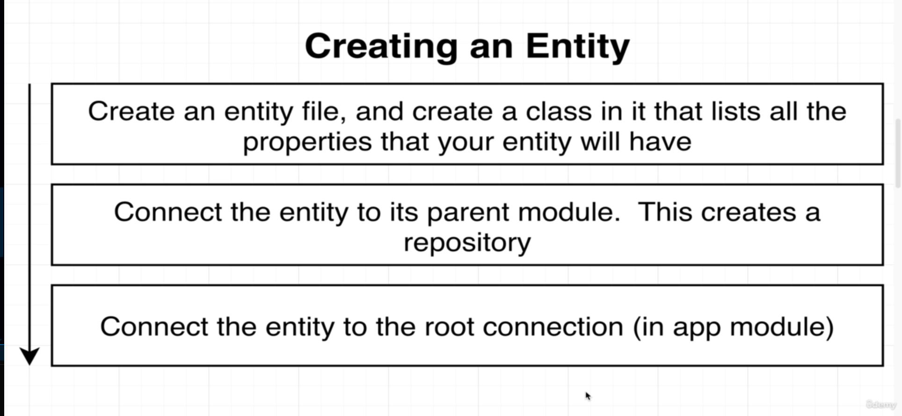

# Knowledge Base

## Application Goal


## Method and Routes of the application


## project modules


## Nest cli to generate modules, controllers, services
- note we don't use nest cli to generate repositories
```bash
nest generate module <module_name>
nest generate controller <controller_name>
nest generate service <service_name>
```

## Persistant data with Nest


## install typeorm
```bash
npm install @nestjs/typeorm typeorm sqlite3
```

## connection with database


## integerate typeorm with nestjs in app.module.ts
```bash
@Module({
  imports: [
    TypeOrmModule.forRoot({
      type: 'sqlite', // type of database
      database: 'db.sqlite', // database name
      entities: [], // entities in database
      synchronize: true,
    }),
    UsersModule,
    ReportsModule,
  ],
  controllers: [AppController],
  providers: [AppService],
})
export class AppModule {}


```

## creating an entity



## typeorm repository API
