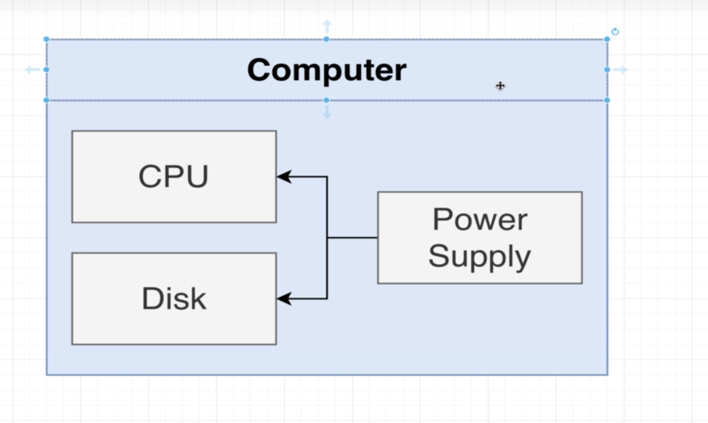
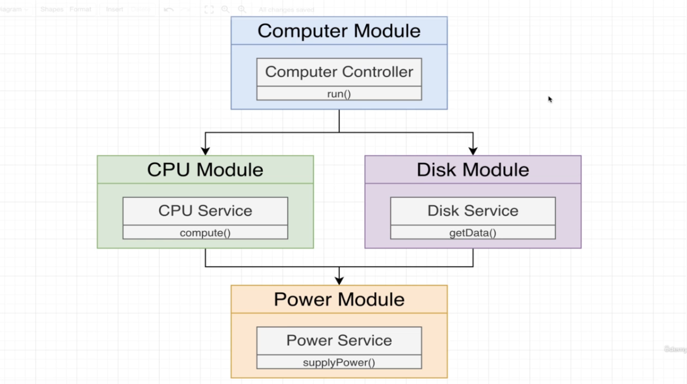

# Knowledge Base

## Application Goal


## Application low level design


## create project
```bash
nest new <application name>
```

## Generate some files
```bash
  nest g module <module name>
  nest g service <service name>
  nest g controller <controller name>
```


## Important points to remember
- Always import the module from another module