# Knowledge Base

## Getting Started

  - Install nestjs cli

  ```bash
  npm install -g @nestjs/cli
  ```

  - setup a new nestjs project
  
  ```bash
  nest new <application-name>
  ```


## Application Goals

Store and retrieve messages stored in a plain JSON file.

## Different Routes of the Application

- Request : GET localhost:3000/messages (retrieve a list of all messages) 

  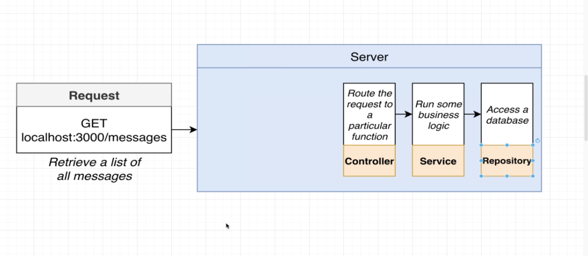


- Request : POST localhost:3000/messages (create a new message) 

  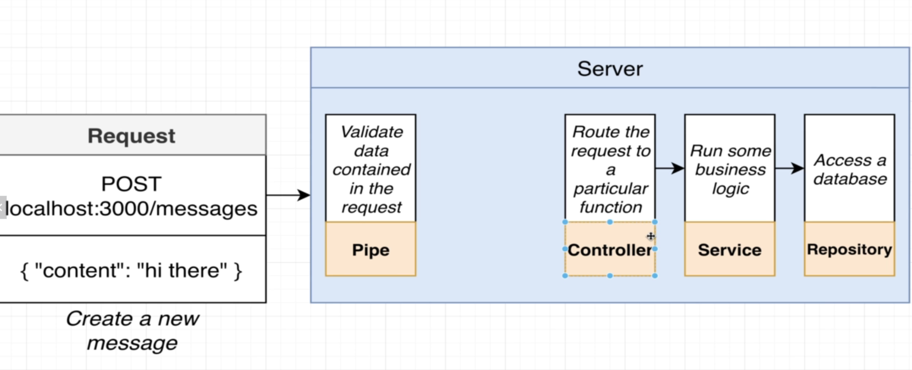

- Request : GET localhost:3000/messages/:id (retrieve a message with a particular id) 

  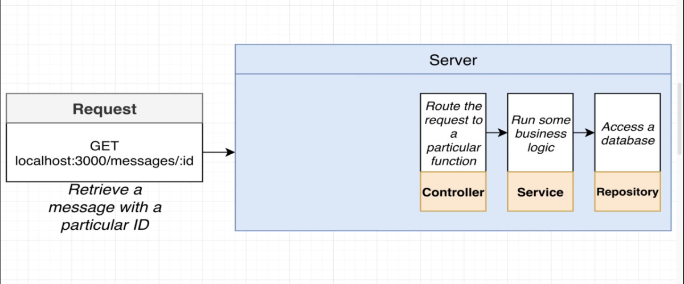


## High Level Design of Application server

  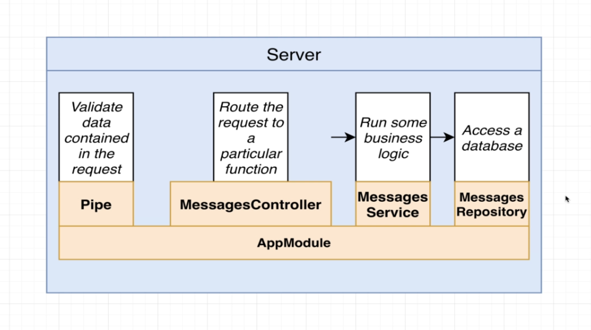


## start a development server
  ```bash
    npm run start:dev
  ```

## NEST JS CLI Commands

  - create a module
  ```bash
    nest generate module messages
  ```

  - generate a controller in messsages module at same level as module

  ```bash
    nest generate controller messages/messages --flat
  ```
  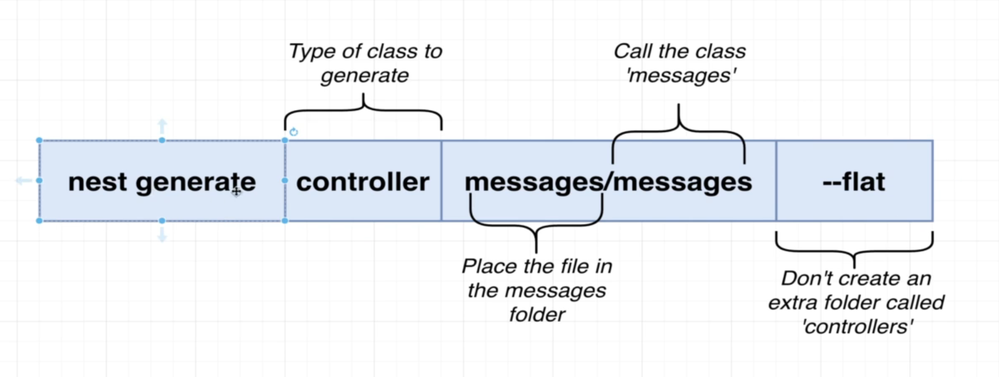


## HTTP Request

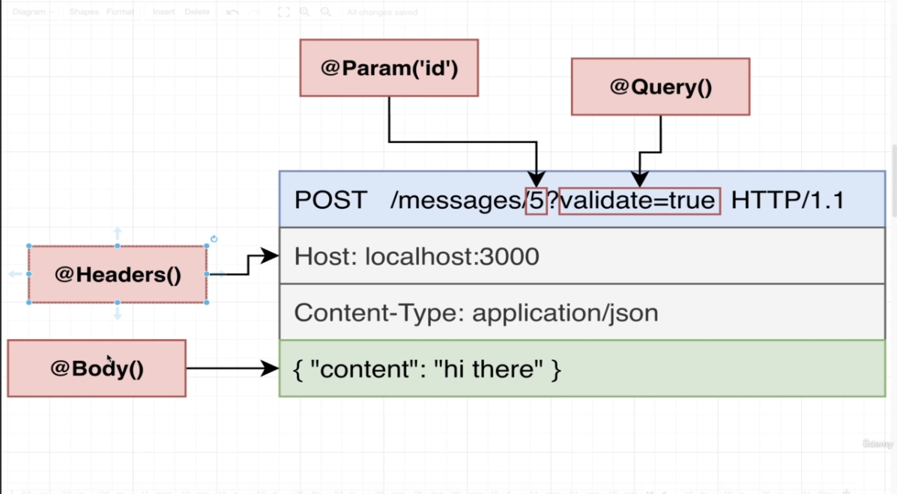


## using pipes for validation
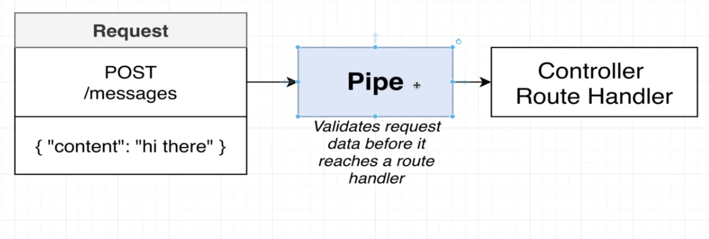

## Validation pipes
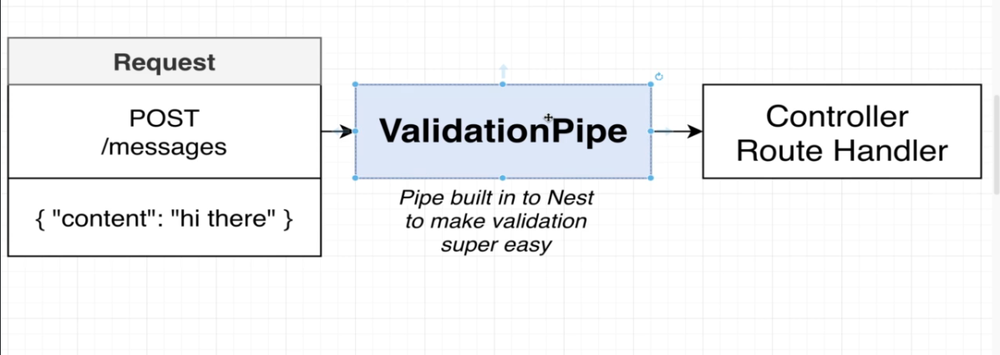

## Setting up Automatic Validation
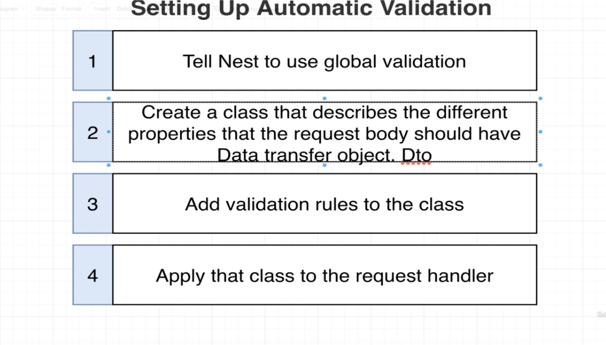

- add the code in main.ts to include validation pipe
  ```ts
  import { ValidationPipe } from '@nestjs/common';

  app.useGlobalPipes(
      new ValidationPipe()
  )
  ```

## Data Transfer Objects

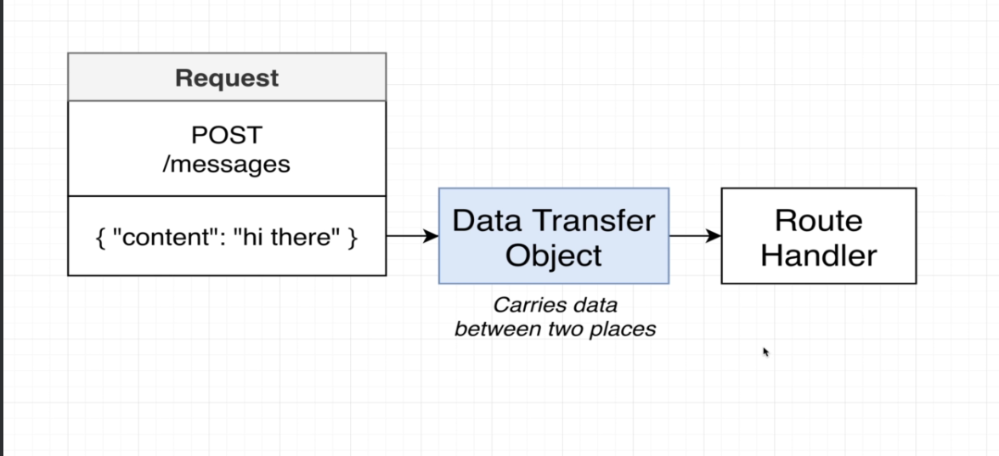


## Add validation rules to the class

- install class-validator and class-transformer library
  ```bash
  npm install class-validator class-transformer
  ```

- example code to create dto
  ```ts
  import { IsString } from "class-validator";

  export class CreateMessageDto{
      @IsString()
      content: string;
  }
  ```

## Behind the scenes of validation

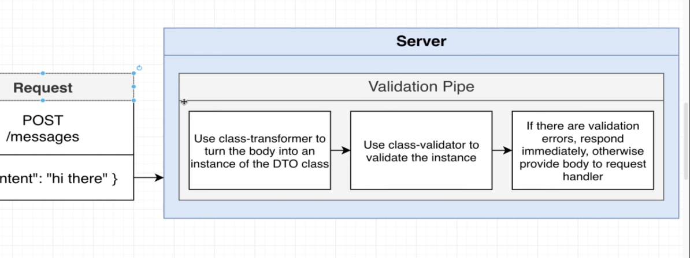


## Services and Repositories

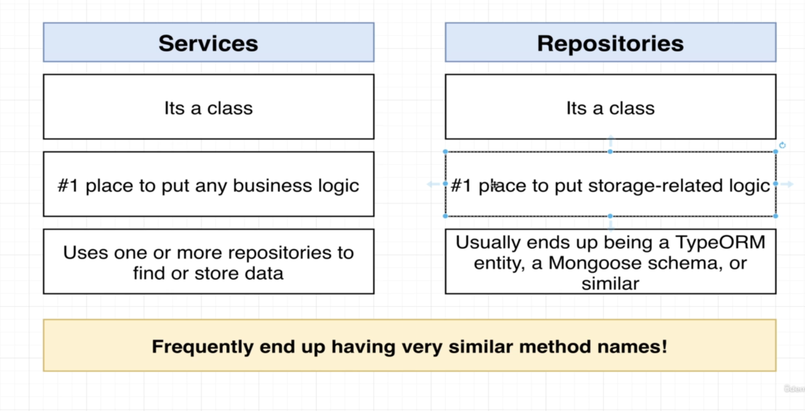


## Dependency Injection

### Inversion of control

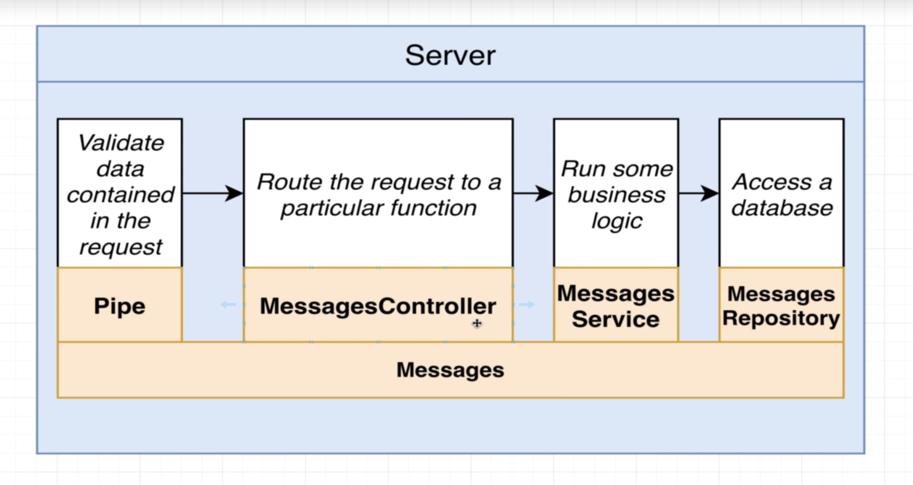

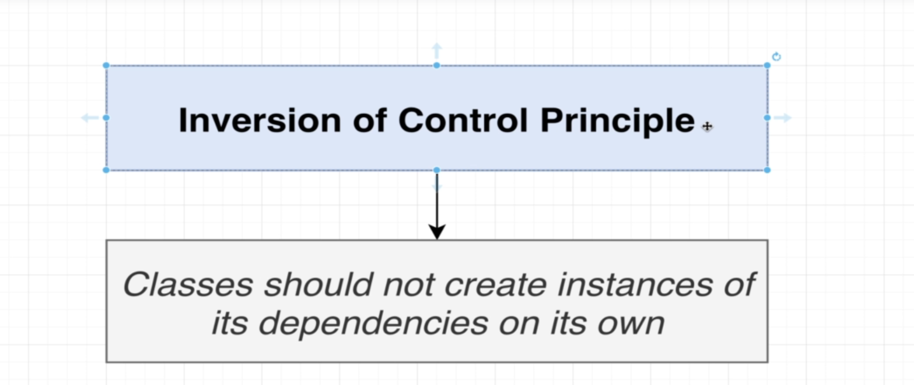


## why? 

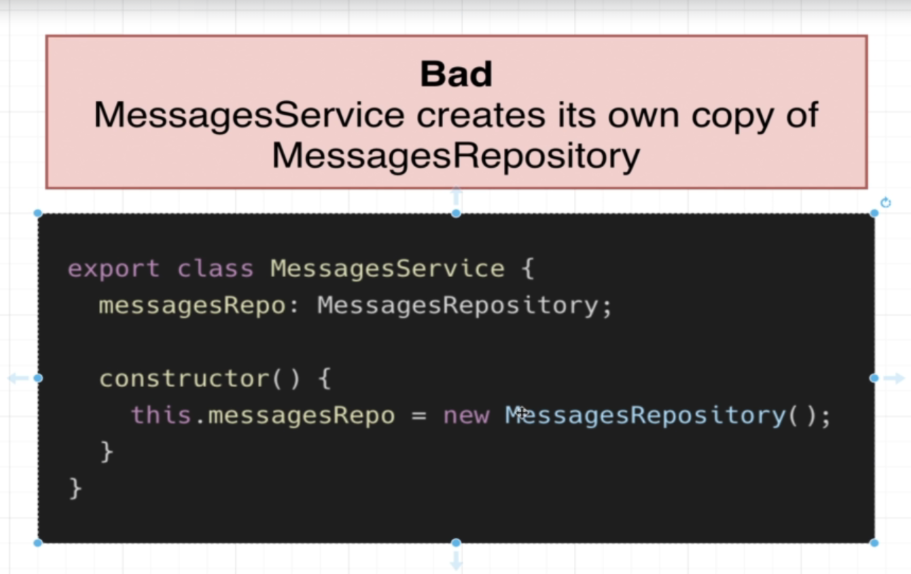
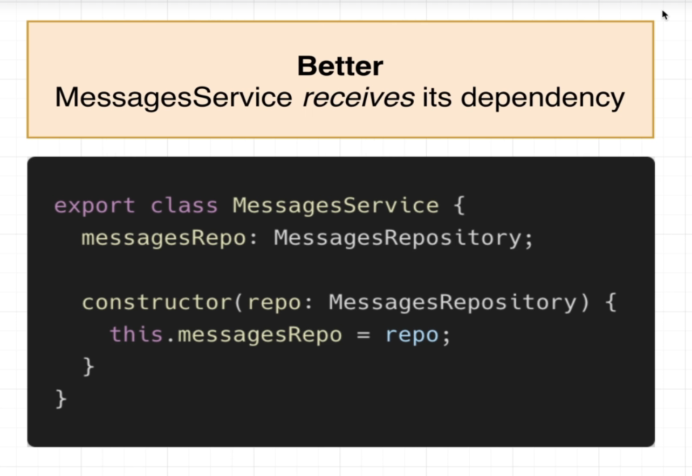
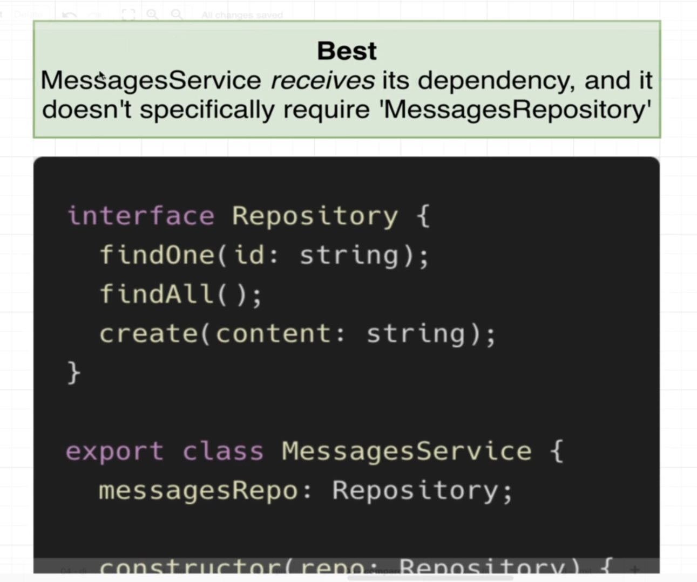


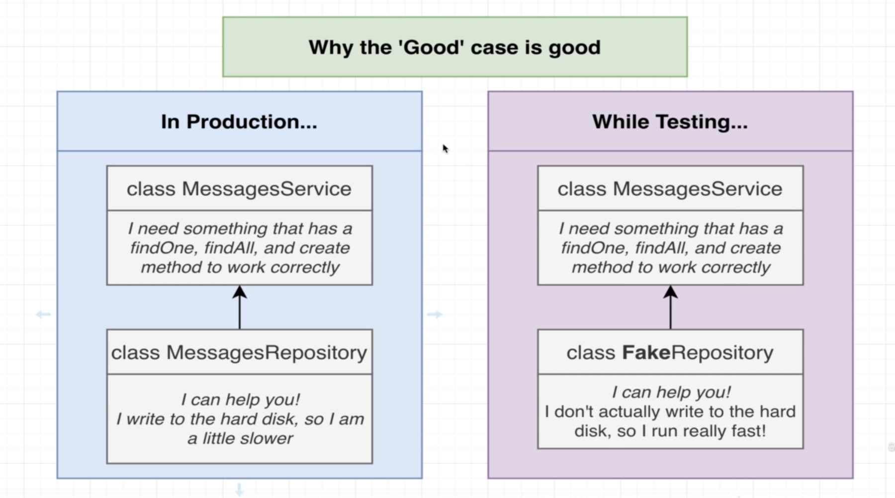

## Nest Dependency injection container/injector

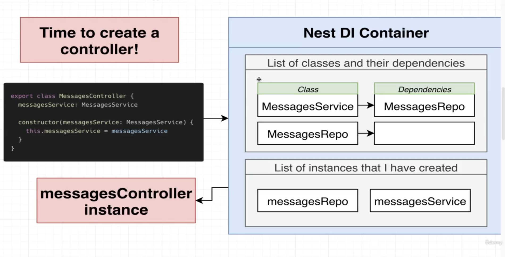
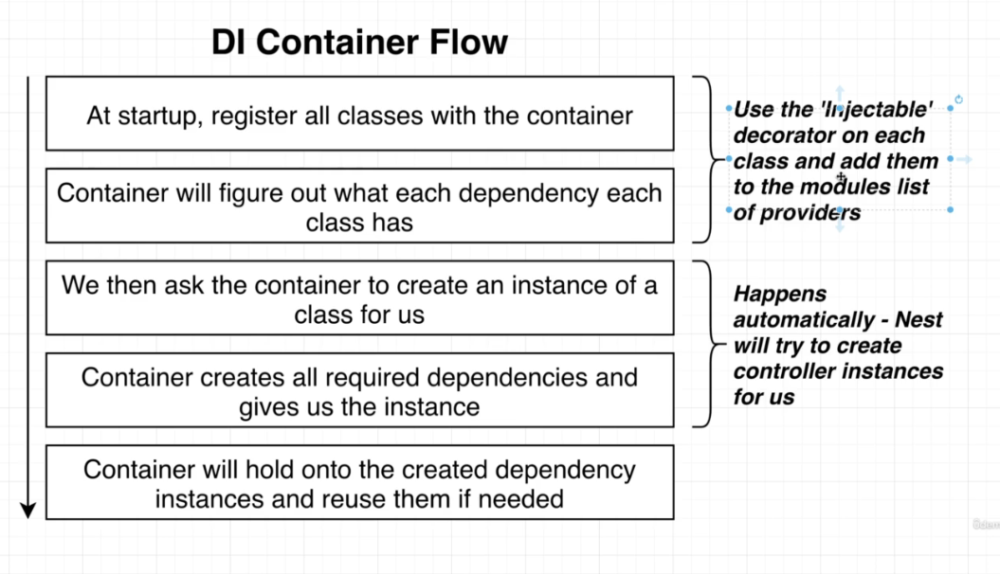

