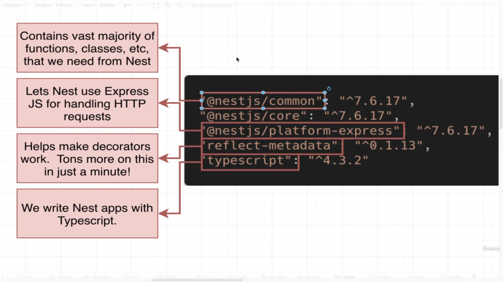
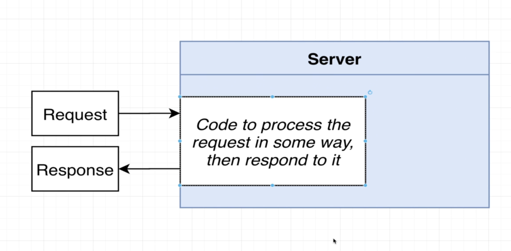
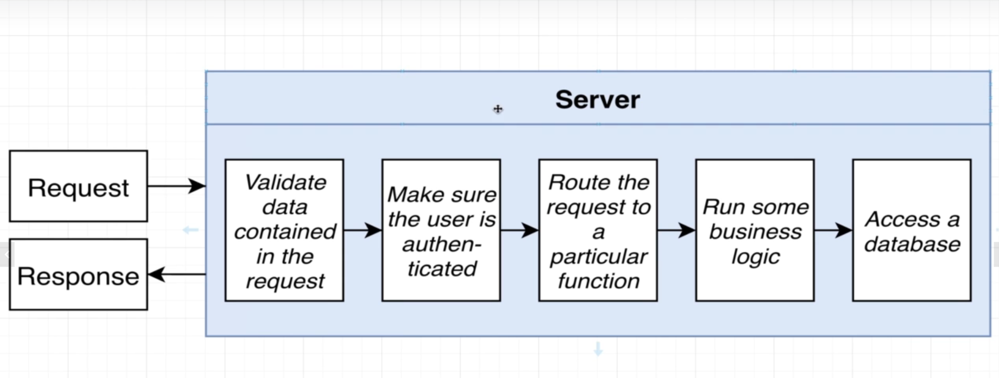
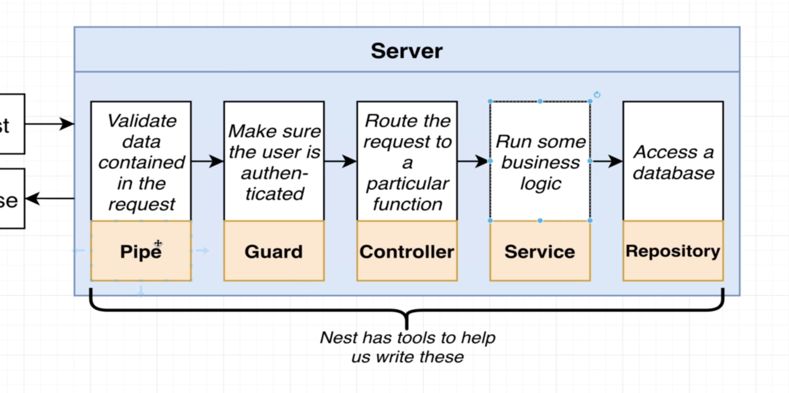
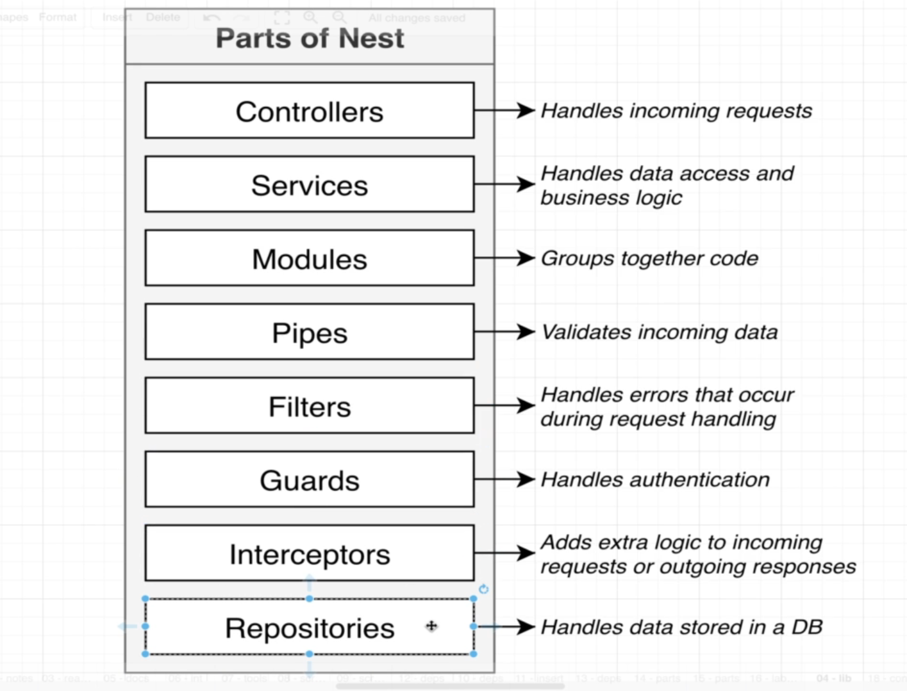
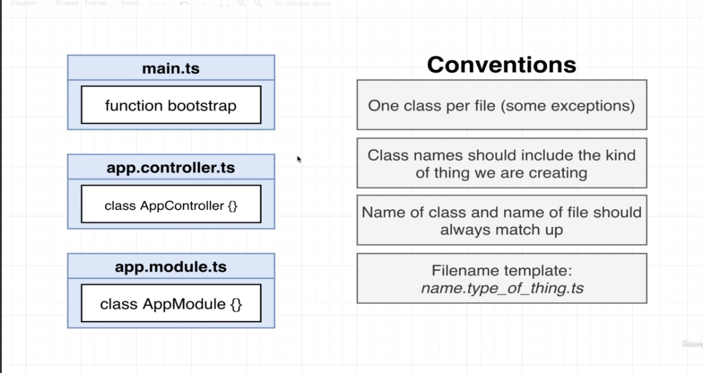

# Instructions

- Intialize the project
    ```bash
    npm init -y
    ```

- Run command to install dependencies.
    ```bash
    npm install @nestjs/common@7.6.17 @nestjs/core@7.6.17 @nestjs/platform-express@7.6.17 reflect-metadata@0.1.13 typescript@4.3.2

- Explanation of each dependency which installed.

    


- set up Typescript compiler settings
    ```bash
    {
        "compilerOptions": {
            "module": "CommonJS",
            "target": "es2017",
            "experimentalDecorators": true,
            "emitDecoratorMetadata": true
        }
    }
    ```

- How server works

    

- General steps involved in server
    
    

- Nest Tools which help us to write these general steps

    

- Parts of NestJs

    

- Create controller , module and bootstrap nest application in src/main.ts
    ```ts
    import { Controller, Module , Get} from "@nestjs/common";
    import { NestFactory } from "@nestjs/core";

    @Controller()
    class AppController{
        @Get()
        getRootRoute(){
            return 'hi there!';
        }
    }

    @Module({
        controllers: [AppController]
    })
    class AppModule{}


    async function bootstrap(){
        const app = await NestFactory.create(AppModule);
        await app.listen(3000);
    }

    bootstrap();
    ```

- Run the nestJs application
    ```bash
    npx ts-node-dev ./src/main.ts
    ```

- File name conventions

    
    


